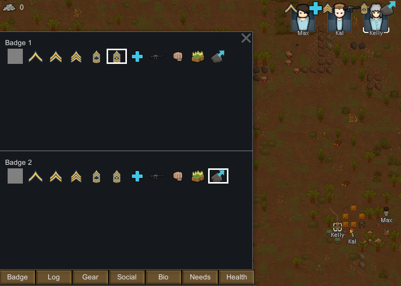

# PawnBadge for RimWorld

A RimWorld mod that allows adding up to 2 informative badges to the colonist bar.



Download:
[https://github.com/RangelReale/RR_PawnBadge/releases/latest](https://github.com/RangelReale/RR_PawnBadge/releases/latest)

### Custom Icons

To make a mod to add more badge icons, in your mod "Defs" directory create a XML file like this:

```xml
<?xml version="1.0" encoding="utf-8" ?>
<Defs>

	<RR_PawnBadge.BadgeDef>
		<defName>Crown</defName>
		<label>Crown</label>
		<description>A golden crown</description>
		<icon>PawnBadge/Crown</icon>
	</RR_PawnBadge.BadgeDef>
	
</Defs>
```

Put a "Crown.png" file in the "Textures/PawnBadge" directory, and it's done!

See [https://github.com/RangelReale/RR_PawnBadge_BadgeSample](this) repository for a sample of a mod adding a new icon.

### Author

Rangel Reale